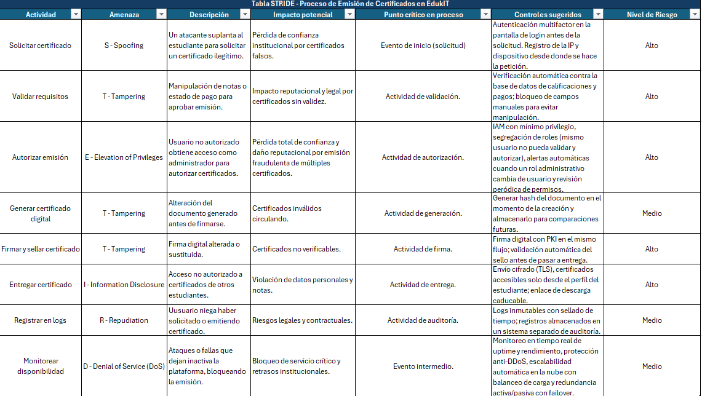
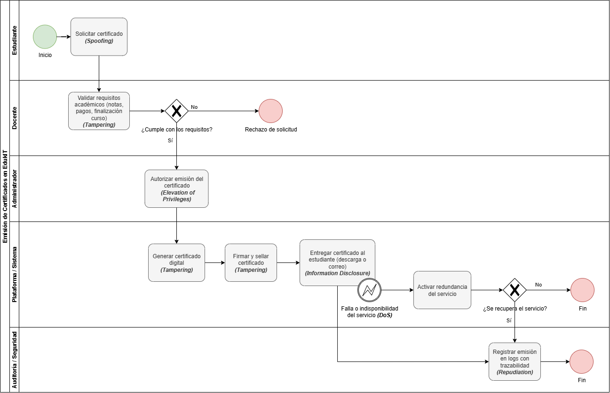

# 🗒️ Registro de Trabajo en Clase - Taller 5

## 📆 Fecha de la sesión
_13/09/2025_

## 👥 Integrantes presentes
- Juan David Cetina Gómez
- Ana Lucía Quintero Vargas
- Mariana Salas Gutiérrez

## 🧠 Actividades realizadas en clase

Durante la sesión se trabajó en el análisis y modelado de un proceso crítico dentro del contexto de la plataforma EdukIT. El equipo discutió diferentes alternativas de procesos (como ingreso de notas o procesamiento de pagos) y finalmente se decidió enfocar el ejercicio en la emisión de certificados, dado su valor legal, reputacional y el riesgo de que pueda ser falsificado o alterado. A partir de allí, se realizaron dos actividades principales: el análisis de amenazas STRIDE documentado en tabla y el modelado en BPMN del flujo.

- **¿Qué se discutió con el equipo?**

    Se debatió qué proceso resultaba más relevante para el ejercicio. Aunque al inicio se consideraron otros procesos más obvios bajo el contexto dado (notas, pagos), se concluyó que la emisión de certificados representaba mejor un escenario crítico de seguridad. Además, se identificaron los actores principales (estudiante, docente, administrador, plataforma y auditoría) y los sistemas involucrados en el flujo.

- **¿Qué decisiones de modelado se tomaron?**

    Se decidió representar el proceso en BPMN, separando los roles en carriles para dar claridad a las responsabilidades. A cada actividad se le asoció la amenaza STRIDE más relevante, lo que permitió vincular el modelado con el análisis de riesgos. También se acordó incluir un flujo alterno en caso de falla de disponibilidad del servicio (DoS), mostrando cómo la plataforma podría activar redundancia y decidir si continuar o finalizar el proceso.

- **¿Qué herramientas se usaron (papel, pizarra, draw.io, Astah)?**

    El equipo optó por draw.io para modelar colaborativamente el BPMN, ya que ofrece los elementos necesarios para representar tareas, eventos y gateways de manera estandarizada. Para el análisis STRIDE se utilizó Excel, lo que facilitó organizar amenazas, descripciones, impactos y controles de mitigación en una tabla estructurada.

- **¿Qué parte del trabajo se alcanzó a desarrollar?**

    Se logró definir el flujo completo en BPMN y avanzar en la construcción de la tabla STRIDE. Como se establecieron divición de roles, algunos integrantes se concentraron en el diagrama mientras otros empezaron con la tabla, lo que permitió adelantar las dos partes en paralelo y dejar listo el camino para seguir refinando la actividad por fuera de la sesión.

## 🧩 Boceto inicial del modelo

El diagrama modela el proceso de emisión de certificados en EdukIT, identificado como crítico por su valor legal y reputacional. El flujo inicia con la solicitud del estudiante y atraviesa diferentes validaciones y tareas hasta la entrega y registro final del certificado. A lo largo del proceso se incorporaron las amenazas del marco STRIDE, lo que permitió relacionar cada actividad con riesgos de seguridad específicos y con los controles planteados en la tabla de análisis.

En la primera parte, el estudiante solicita el certificado, donde se identificó el riesgo de spoofing; para mitigarlo se propone en la tabla stride hacer autenticación multifactor y control de sesiones. Luego, el docente valida los requisitos académicos y en este punto surge la amenaza de tampering, relacionada con la posible manipulación de notas o pagos; la mitigación incluye validación automática contra bases de datos y trazabilidad.

Posteriormente, el administrador autoriza la emisión, actividad asociada al riesgo de elevación de privilegios, frente al cual se definieron controles como segregación de funciones y monitoreo de roles. En la fase de plataforma, se generan y firman los certificados digitales, ambos pasos también expuestos a tampering, lo que justifica la implementación de hashes, plantillas seguras y firma digital robusta.

Más adelante, al entregar el certificado al estudiante, se evidenció el riesgo de divulgación de información, por lo que se plantearon medidas como cifrado TLS y enlaces de descarga temporales. Adicionalmente, se modeló un flujo alterno para fallas o ataques de denegación de servicio (DoS), con una tarea de redundancia y un gateway que decide si el servicio se recupera o no. Finalmente, en el registro de emisión en logs se contempló la amenaza de repudiation, mitigada mediante bitácoras inmutables y sellado de tiempo.

En conjunto, el diagrama y la tabla reflejan cómo cada tarea crítica del proceso está asociada a un riesgo STRIDE y a controles específicos, lo que asegura una trazabilidad clara entre el flujo de negocio y la gestión de seguridad.

## 🔁 Tareas definidas para complementar el taller

Anote las responsabilidades acordadas entre los miembros del equipo para completar la entrega final:

| Tarea asignada | Responsable | Fecha estimada |
|----------------|-------------|----------------|
| Modelado final en draw.io | Mariana Salas Gutiérrez, Juan David Cetina Gómez y Ana Lucía Quintero Vargas | 13/08 |
| Redacción del informe     | Mariana Salas Gutiérrez y Ana Lucía Quintero Vargas | 17/08 |
| Investigación y referencias | Juan David Cetina Gómez | 19/08 |

---

_Este documento resume el trabajo colaborativo realizado durante la sesión del taller 5 en el curso AREM - Universidad de La Sabana._
